# Industry Level Git Commands

## 1. Git Configuration Commands

### 1. git config --global user.name
**Syntax**
git config --global user.name
**Purpose**
Sets the global username for Git commits.
**Example**
git config --global user.name "VIKRAM-N220575"

### 2. git config --global user.email
**Syntax**
git config --global user.email
**Purpose**
Sets the email associated with commits.
**Example**
git config --global user.email

### 3. git config --list
**Syntax**
git config --list
**Purpose**
Displays all Git configuration settings
**Example**
git config --list

### 4. git config --unset
**Syntax**
git config --unset <key>
**Purpose**
Removes a configuration value from Git settings.
It is used when you want to delete a previously set configuration like username, email, or other settings.
**Example**
git config --global --unset user.name

**ScreenShot**
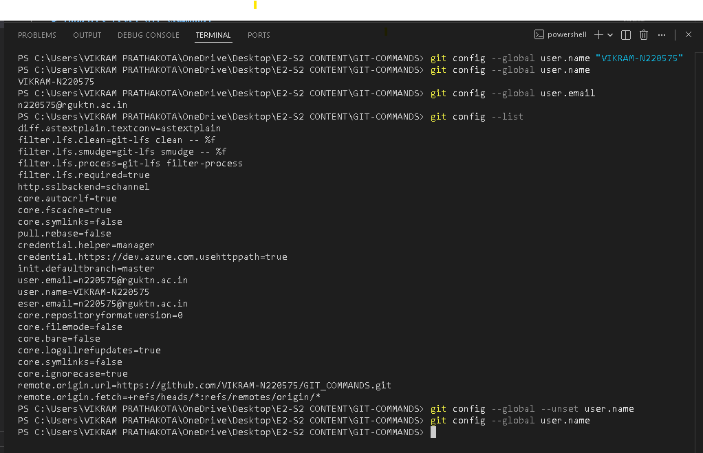

## 2. Repository setup commands
### 1. git init
**Syntax**
git init
**Purpose**
Initializes a new Git repository in the current directory.
It creates a hidden .git folder that tracks all repository changes.
**Example**
git init

### 2. git clone
**Syntax**
git clone repo-url
**Purpose**
Creates a local copy of an existing remote repository from platforms like GitHub.
It downloads:
the project files
commit history
branches
**Example**
git clone https://github.com/VIKRAM-N220575/GIT_COMMANDS.git

### 3. git clone --branch
**Syntax**
git clone --branch branchname repo-url
**Purpose**
Clones a repository and checks out a specific branch instead of the default branch.
**Example**
git clone --branch main https://github.com/VIKRAM-N220575/GIT_COMMANDS.git

### 4. git clone --depth
**Syntax**
git clone --depth <number> <repository-url>
**Purpose**
Performs a shallow clone, meaning Git downloads only the latest commits instead of the entire history.
This makes cloning much faster.
**Example**
git clone --depth 1 https://github.com/git/git.git

**Screenshot**
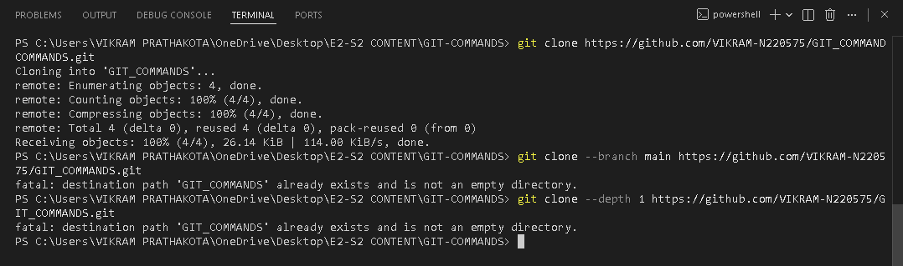

## Repository status and inspection
### 1. git status
**Syntax**
**Purpose**
**Example**
**Syntax**
git status
**Purpose**
Shows the current state of the repository, including:
modified files
staged files
untracked files
current branch
**Example**
git status

### 2. git log
**Syntax**
git log
**Purpose**
Displays the complete commit history of the repository.
It shows:
commit ID
author
date
commit message
**Example**
git log

### 3. git log --oneline
**Syntax**
git log --oneline
**Purpose**
Shows commit history in short one-line format
**Example**
git log --oneline

### 4. git log --graph
**Syntax**
git log --graph
**Purpose**
Displays commit history as a branch graph visualization.
**Example**
git log --graph --oneline

### 5.  git show
**Syntax**
git show <commit-id>
**Purpose**
Shows detailed information about a specific commit, including changes made.
**Example**
git show HEAD

### 6. git diff
**Syntax**
git diff
**Purpose**
Shows differences between working directory and staging area.
**Example**
git diff

### 7. git diff --staged
**Syntax**
git diff --staged
**Purpose**
Shows differences between staged files and last commit.
**Example**
git diff --staged

### 8. git blame
**Syntax**
git blame <file>
**Purpose**
Shows who last modified each line of a file.
**Example**
git blame index.hmtl

### 9. git reflog
**Syntax**
git reflog
**Purpose**
Shows a history of all HEAD movements (branch switches, resets, commits).
Very useful for recovering lost commits
**Example**
git reflog

### 10. git shortlog
**Syntax**
git shortlog
**Purpose**
Displays a summary of commits grouped by author.
**Example**
git shortlog

**Screenshots**
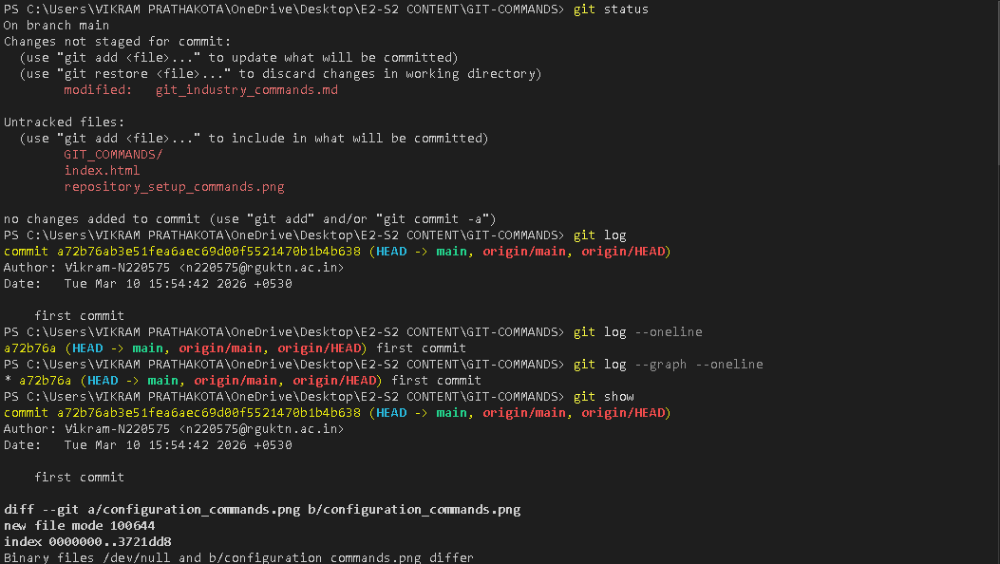 
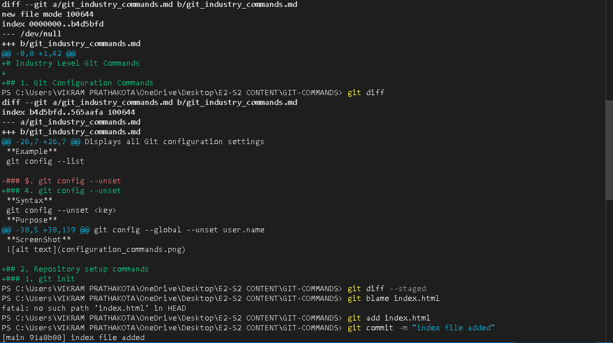
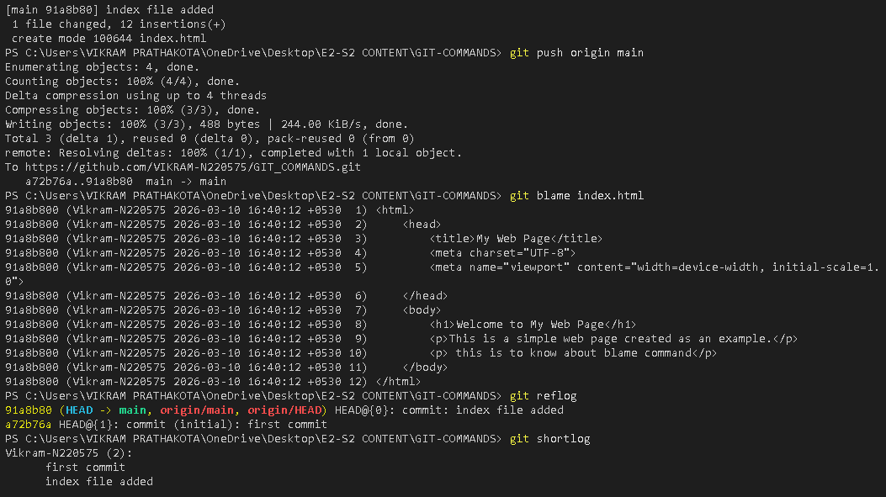

## File Tracking Commands
### 1. git add
**Syntax**
git add <file-name>
**Purpose**
Adds a specific file to the staging area so it can be included in the next commit.
**Example**
git add repo_status&inspection-1.png

### 2. git add .
**Syntax**
git add .
**Purpose**
Adds all modified and new files in the current directory to the staging area.
**Example**
git add .

### 3. git add -p
**Syntax**
git add -p
**Purpose**
Allows you to stage changes interactively.
You can choose which parts (hunks) of the file should be added to staging.
**Example**
git add -p

### 4. git restore
**Syntax**
git restore <file-name>
**Purpose**
Discards changes in the working directory and restores the file to the last committed version.
**Example**
git restore index.html

### 5. git restore --staged
**Syntax**
git restore --staged <file-name>
**Purpose**
Removes a file from the staging area but keeps the changes in the working directory.
**Example**
git restore --staged index.html

### 6. git rm
**Syntax**
git rm <file-name>
**Purpose**
Deletes a file from the working directory and Git repository.
**Example**
git rm test.txt

### 7. git mv
**Syntax**
git mv <old-name> <new-name>
**Purpose**
Moves or renames a file and stages the change automatically.
**Example**
git mv oldfile.txt newfile.txt

**Screenshots**
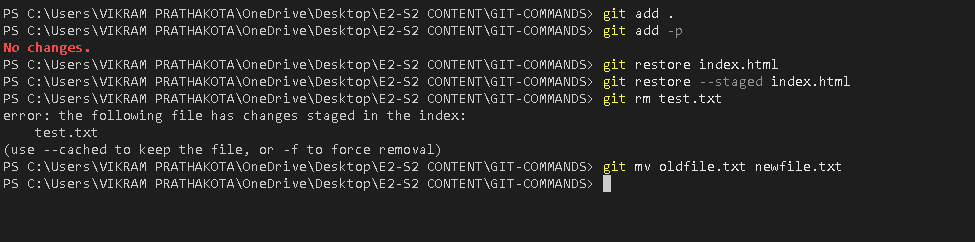

## Commit Commands
### 1. git commit
**Syntax**
git commit
**Purpose**
Records the staged changes in the repository as a new commit.
This command opens the default text editor to write a commit message.
**Example**
git commit

### 2. git commit -m
**Syntax**
git commit -m "commit message"
**Purpose**
Creates a commit and adds the commit message directly in the terminal.
**Example**
git commit -m "Added commit commands"

### 3. git commit --amend
**Syntax**
git commit ammend
**Purpose**
Used to modify the most recent commit.
You can change the commit message or add new changes to the last commit.
**Example**
git commit --amend test.txt

### 4. git commit --no-edit
**Syntax**
git commit --amend --no-edit
**Purpose**
Updates the last commit without changing the commit message.
**Example**
git commit --amend --no-edit

### 6. Branch commands 
1. git branch

Syntax
git branch
Purpose
Lists all local branches in the repository.
Example
git branch

2. git branch -a

Syntax
git branch -a
Purpose
Lists all branches including local and remote branches.
Example
git branch -a

3. git branch -d

Syntax
git branch -d branch-name
Purpose
Deletes a branch safely (only if it is already merged).
Example
git branch -d testbranch

4. git branch -D

Syntax
git branch -D branch-name
Purpose
Force deletes a branch even if it is not merged.
Example
git branch -D testbranch

5. git checkout

Syntax
git checkout branch-name
Purpose
Switches to an existing branch.
Example
git checkout main

6. git checkout -b

Syntax
git checkout -b branch-name
Purpose
Creates a new branch and switches to it.
Example
git checkout -b feature-login

7. git switch

Syntax
git switch branch-name
Purpose
Switches to an existing branch (modern alternative to checkout).
Example
git switch main

8. git switch -c

Syntax
git switch -c branch-name
Purpose
Creates a new branch and switches to it (modern method).
Example
git switch -c feature-dashboard

screesnshot 

### merge and integration
1. git merge

Syntax
git merge branch-name
Purpose
Merges the specified branch into the current branch.
Example
git merge feature-login

2. git merge --no-ff

Syntax
git merge --no-ff branch-name
Purpose
Performs a merge without fast-forwarding, creating a separate merge commit to preserve branch history.
Example
git merge --no-ff feature-login

### remote repository commands
1. git remote

Syntax
git remote
Purpose
Displays the names of remote repositories connected to the project.
Example
git remote

2. git remote -v

Syntax
git remote -v
Purpose
Shows remote repository URLs along with their names.
Example
git remote -v

3. git remote add

Syntax
git remote add origin repository-url
Purpose
Adds a new remote repository.
Example
git remote add origin https://github.com/user/project.git

4. git remote remove

Syntax
git remote remove remote-name
Purpose
Removes a remote repository connection.
Example
git remote remove origin

5. git fetch

Syntax
git fetch
Purpose
Downloads changes from the remote repository without merging them.
Example
git fetch

6. git fetch --all

Syntax
git fetch --all
Purpose
Fetches updates from all remote repositories.
Example
git fetch --all

7. git pull

Syntax
git pull origin branch-name
Purpose
Fetches and merges changes from the remote repository.
Example
git pull origin main

8. git pull --rebase

Syntax
git pull --rebase origin branch-name
Purpose
Fetches changes and applies them using rebase instead of merge.
Example
git pull --rebase origin main

9. git push

Syntax
git push origin branch-name
Purpose
Uploads local commits to the remote repository.
Example
git push origin main

10. git push -u origin branch-name

Syntax
git push -u origin branch-name
Purpose
Pushes the branch and sets upstream tracking.
Example
git push -u origin feature-login

11. git push --force

Syntax
git push --force
Purpose
Forces pushing changes, overwriting remote history.
Example
git push --force
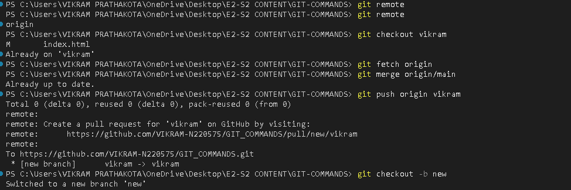

### stash commands
1. git stash

Syntax
git stash
Purpose
Temporarily saves uncommitted changes so you can work on something else.
Example
git stash

2. git stash list

Syntax
git stash list
Purpose
Displays all saved stashes.
Example
git stash list

3. git stash pop

Syntax
git stash pop
Purpose
Applies the latest stash and removes it from the stash list.
Example
git stash pop

4. git stash apply

Syntax
git stash apply
Purpose
Applies a stash without removing it from the stash list.
Example
git stash apply

5. git stash drop

Syntax
git stash drop
Purpose
Deletes a specific stash from the list.
Example
git stash drop stash@{0}

6. git stash clear

Syntax
git stash clear
Purpose
Removes all stashes permanently.
Example
git stash clear

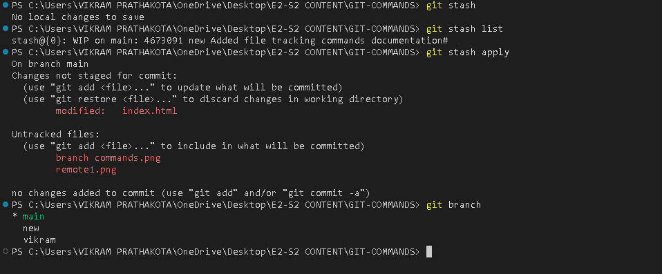

### reset and undo commands
1. git reset

Syntax
git reset <commit-id>
Purpose
Resets the current HEAD to a specified commit.
Example
git reset abc123

2. git reset --soft

Syntax
git reset --soft <commit-id>
Purpose
Moves HEAD to the specified commit but keeps changes in the staging area.
Example
git reset --soft HEAD~1

3. git reset --mixed

Syntax
git reset --mixed <commit-id>
Purpose
Moves HEAD to the specified commit and unstages the changes but keeps them in the working directory.
Example
git reset --mixed HEAD~1

4. git reset --hard

Syntax
git reset --hard <commit-id>
Purpose
Resets everything (HEAD, staging, working directory) and deletes all changes.
Example
git reset --hard HEAD~1

5. git revert

Syntax
git revert <commit-id>
Purpose
Creates a new commit that undoes the changes of a previous commit.
Example
git revert abc123

6. git clean -f

Syntax
git clean -f
Purpose
Removes untracked files from the working directory.
Example
git clean -f

7. git clean -fd

Syntax
git clean -fd
Purpose
Removes untracked files and directories.
Example
git clean -fd
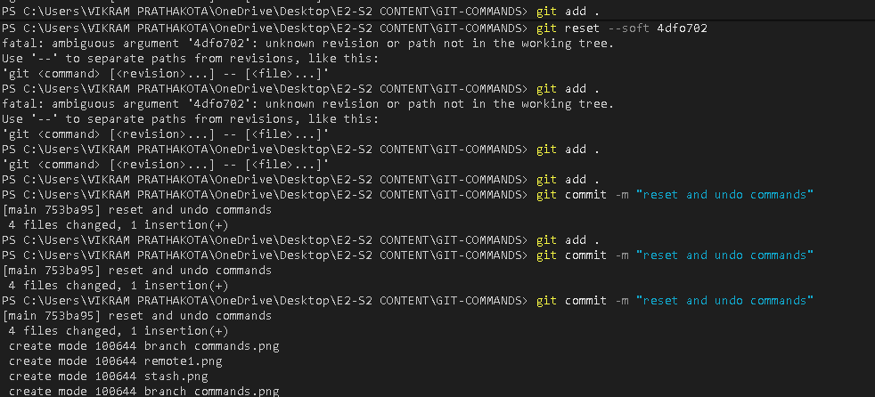

### rebase
1. git rebase

Syntax
git rebase branch-name
Purpose
Reapplies commits from the current branch onto another branch, creating a linear history.
Example
git rebase main

2. git rebase -i

Syntax
git rebase -i <commit-id>
Purpose
Starts an interactive rebase to edit, squash, or reorder commits.
Example
git rebase -i HEAD~3

3. git rebase --continue

Syntax
git rebase --continue
Purpose
Continues the rebase process after resolving conflicts.
Example
git rebase --continue

4. git rebase --abort

Syntax
git rebase --abort
Purpose
Cancels the rebase process and restores the branch to its previous state.
Example
git rebase --abort

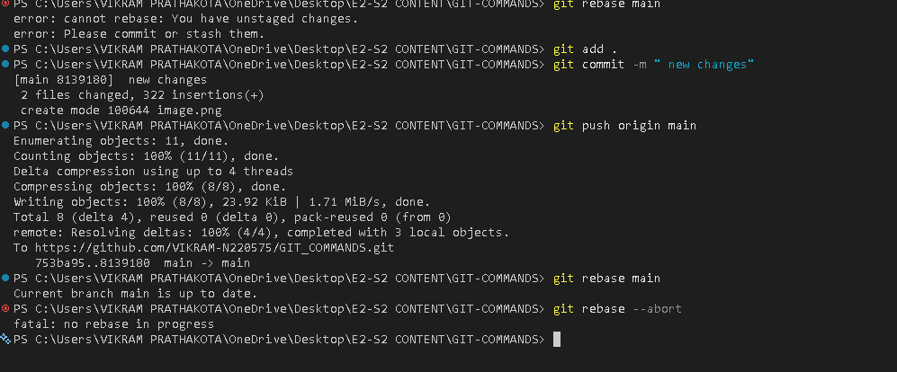

### cherry pick
1. git cherry-pick

Syntax
git cherry-pick <commit-id>
Purpose
Applies a specific commit from one branch to another branch.
Example
git cherry-pick abc123

2. git format-patch

Syntax
git format-patch <commit-id>
Purpose
Creates patch files from commits that can be shared or applied elsewhere.
Example
git format-patch HEAD~1

3. git apply

Syntax
git apply <patch-file>
Purpose
Applies changes from a patch file to the working directory without creating a commit.
Example
git apply 0001-change.patch

4. git am

Syntax
git am <patch-file>
Purpose
Applies a patch file and creates a commit from it.
Example
git am 0001-change.patch
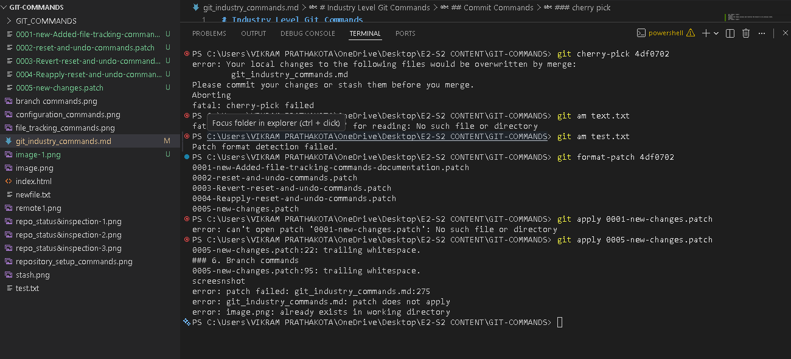

### tags
1. git tag

Syntax
git tag
Purpose
Lists all tags in the repository.
Example
git tag

2. git tag -a

Syntax
git tag -a tag-name -m "message"
Purpose
Creates an annotated tag with a message.
Example
git tag -a v1.0 -m "First release"

3. git tag -d

Syntax
git tag -d tag-name
Purpose
Deletes a tag from the local repository.
Example
git tag -d v1.0

4. git push origin --tags

Syntax
git push origin --tags
Purpose
Pushes all local tags to the remote repository.
Example
git push origin --tags

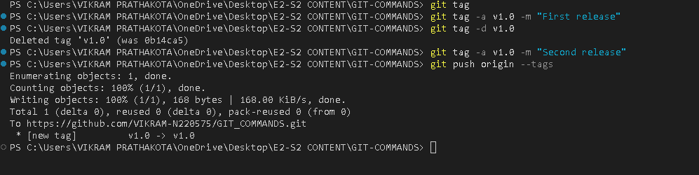

1. git submodule add

Syntax
git submodule add <repository-url>
Purpose
Adds another Git repository as a submodule inside your current repository.
Example
git submodule add https://github.com/user/library.git

2. git submodule init

Syntax
git submodule init
Purpose
Initializes submodules after cloning a repository that contains them.
Example
git submodule init

3. git submodule update

Syntax
git submodule update
Purpose
Fetches and checks out the content of submodules.
Example
git submodule update
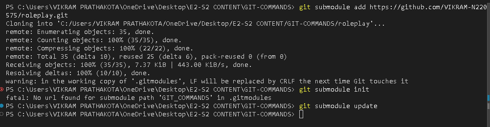

1. git bisect

Syntax
git bisect
Purpose
Helps find the commit that introduced a bug using binary search.
Example
git bisect

2. git bisect start

Syntax
git bisect start
Purpose
Starts the bisect process to locate a faulty commit.
Example
git bisect start

3. git bisect good

Syntax
git bisect good <commit-id>
Purpose
Marks a commit as good (no bug present).
Example
git bisect good abc123

4. git bisect bad

Syntax
git bisect bad <commit-id>
Purpose
Marks a commit as bad (bug present).
Example
git bisect bad def456

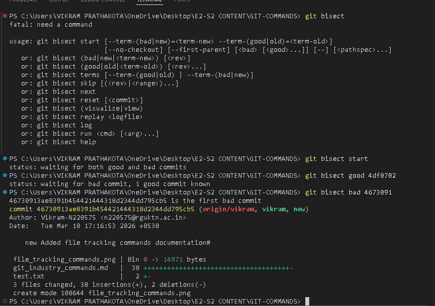